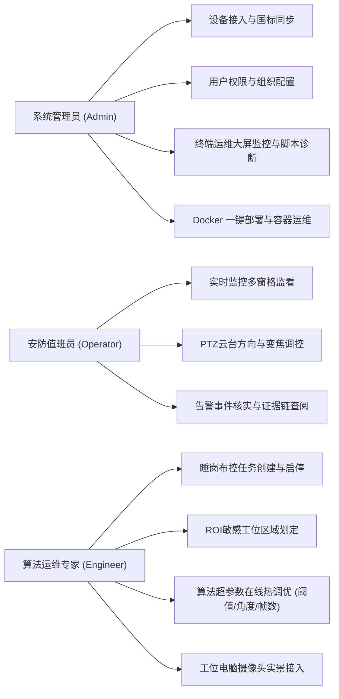

# easySVA 安全视频分析平台 - 需求规格说明书 (SRS)

**文档编号**：SVA-REQ-2026-V2.5  
**编制团队**：easySVA 研发工程团队  
**适用课程**：大三软件工程实训·企业应用设计实践（Hackathon 敏捷实战）  
**指导教师**：吴军、孙溢  
**当前版本**：v2.5 (全功能增强版：含 GB28181 接入、YOLO-Pose 睡岗检测、云台控制 PTZ、算法参数动态热加载、电脑摄像头实景接入、自愈转桥守护及 Docker 一键免编译部署)  
**编写时间**：2026年9月  

---

## 一、 引言

### 1.1 编写目的
本文档详细阐明面向中小企业及工业园区的轻量化分布式 AI 视频分析系统（easySVA）的业务背景、用户角色、系统边界、功能性需求（FR）及非功能性需求（NFR）。文档作为系统分析、架构设计、开发实现、测试验收、Docker 容器化交付及现场评审的全流程基准依据。

### 1.2 背景与业务痛点
当前工业生产现场、建筑工地及园区安防普遍存在以下痛点：
1. **多厂商设备孤岛严重**：海康威视、大华、宇视等安防摄像头协议不一，传统平台大多仅支持特定 RTSP 拉流，缺乏对国家安防监控联网标准协议（GB/T 28181-2016）的主动接入与集中管控能力。
2. **人工监屏易疲劳与误判**：安防与生产监管依赖值班人员肉眼监察，夜间或高压作业下值班人员脱岗、打瞌睡、俯身睡岗等隐患难以实时捕捉。
3. **传统目标检测算法漏判误报率高**：普通通用目标检测（如单纯识别“人”）无法理解人体行为姿态，易将坐姿低头操作、弯腰捡物误判为睡岗，抗干扰能力弱。
4. **算法超参数缺乏在线调优能力**：不同摄像头视场角、安装高度、光照及工位距离差异大，传统方案修改置信度或角度阈值需重新编译代码或重启服务，导致布控中断。
5. **硬件设备门槛与交付部署繁琐**：评测与演示环境缺乏实体安防球机，且各开发机器环境不一，传统源码编译依赖众多（GCC/CUDA/OpenCV/JDK/MySQL/Redis/FFmpeg），极易因依赖版本冲突导致部署失败。

### 1.3 术语与缩略词定义
| 术语 / 缩写 | 英文全称 | 术语解释 |
| :--- | :--- | :--- |
| **easySVA** | easy Surveillance Video Analytics | 本轻量化分布式 AI 视频分析系统 |
| **GB/T 28181** | 国家安防视频监控联网系统信息传输规范 | 我国公共安全视频图像信息联网国家标准 |
| **SIP** | Session Initiation Protocol | 会话初始协议，负责国标信令注册、保活、点播与控制 |
| **RTP/PS** | Real-time Transport Protocol / Program Stream | 实时传输协议 / MPEG-PS 程序流封装格式 |
| **PTZ** | Pan / Tilt / Zoom | 云台摄像机：水平旋转、垂直俯仰与镜头变焦拉伸 |
| **YOLO-Pose** | YOLO Pose Estimation | 基于深度学习的单阶段多人体 17 关键点姿态估计算法 |
| **MSE** | Media Source Extensions | 浏览器多媒体扩展 API，用于网页端分片解封装播放 |
| **CFR** | Constant Frame Rate | 恒定帧率，视频推流稳定性保障机制 |
| **Hot-Reload** | Dynamic Hot Reloading | 动态参数在线热重载，运行时免重启进程生效新配置 |
| **Docker Compose**| Docker Multi-Container Orchestration | 多容器一键编排技术，实现 7 大微服务免编译开箱即用 |

---

## 二、 任务目标与系统总体描述

### 2.1 建设目标
1. **统一流媒体接入中台**：兼容传统 RTSP 直拉流、GB/T 28181-2016 国标设备主动注册流以及本地工位电脑摄像头 WebM 实时注入流，构建多源异构流媒体处理底座。
2. **边缘智能睡岗分析与在线调优**：集成 YOLO-Pose 算法与多帧时序空间状态机，并提供算法参数在线动态热重载能力，实现秒级高召回、低误报且自适应多场景的工位睡岗全自动监测。
3. **全双工云台交互（PTZ）**：提供基于国标 8 字节 Hex 指令与前端 GPU 电子云台联动的全向视口控制体验。
4. **全自愈高可用流媒体转推守护**：构建具备设备上下线感知能力的守护进程（`gb_bridge_daemon.py`），杜绝 404/409 盲目重试，实现断流自愈与平稳恢复。
5. **Docker Desktop 一键免编译极速交付**：交付 7 大微服务全栈容器镜像包，评测专家与组员电脑无需安装任何开发环境，3 步一键启动全套系统。

### 2.2 用户角色与用例体系

---

## 三、 功能性需求 (Functional Requirements)

### 3.1 核心任务一：GB28181 国标设备接入与全生命周期管理 (FR-GB)
- **FR-GB-01 设备主动注册与鉴权**：开放 UDP 5060 端口作为国标 SIP 服务，接收来自国标摄像机/模拟器的 `REGISTER` 注册请求，支持免密与 Digest 摘要鉴权，在内存与数据库中维护在线状态。
- **FR-GB-02 状态保活与心跳检测**：周期性接收设备发送的 SIP `MESSAGE (Keepalive)` 心跳（默认 15 秒）。系统维护心跳衰减计时器，超过 45 秒（连续 3 次心跳丢失）自动判定离线并同步状态。
- **FR-GB-03 优雅注销与主动下线**：接收 `Expires=0` 的注销信令，立即释放绑定的流媒体资源并更新数据库；提供 `device_offline.sh` 脚本支持对特定设备模拟离线下电。
- **FR-GB-04 一键全量同步**：后端提供 REST 接口，允许前端管理界面一键调用 ZLMediaKit/GbSipServer 接口，将新上线的国标设备批量同步到 `h_device` 表中，支持去重防重幂等插入。
- **FR-GB-05 实时流按需点播 (INVITE)**：用户或分析任务请求监控流时，系统向设备发送 SIP `INVITE` 信令携带 SDP 端口协商，设备响应 200 OK 后开启 RTP 推流；观看结束或任务停止时发送 `BYE` 信令释放推流端口。

### 3.2 核心任务二：YOLO-Pose 工位睡岗行为检测算法 (FR-POSE)
- **FR-POSE-01 关键点姿态感知**：C++ 分析器集成 YOLO-Pose 模型，对视频流每一帧中的人员定位 17 个关键点（鼻子、左右眼、左右耳、左右肩、左右肘、左右腕、左右髋、左右膝、左右踝）。
- **FR-POSE-02 几何空间姿态解算**：
  - 计算头部俯仰倾角 $	heta_{head}$（根据鼻子、耳朵与肩膀相对垂直距离）；
  - 计算躯干倾斜角度 $	heta_{torso}$（脊柱/颈部中点与骨盆连线角度）；
  - 计算屈膝屈髋角度 $	heta_{knee}$（髋部、膝盖与踝关节夹角）；
  - 综合判定人员当前是否处于低头、趴桌或仰面酣睡状态。
- **FR-POSE-03 多帧时序滑动窗口消抖**：系统必须支持时序滤波，严禁依据单帧结果即判定告警。设定连续 $N$ 帧低头计数器（如 25fps 下连续 5 秒低头 125 帧），有效过滤饮水、打字低头、弯腰捡笔等瞬态正常行为。
- **FR-POSE-04 ROI 工位敏感区域布控**：支持用户在 Web 前端通过多边形锚点标注指定工位区域，算法推理仅对区域内人员生效，屏蔽走廊走动人员的误干扰。
- **FR-POSE-05 告警证据链抓拍与推送**：一旦确诊睡岗，立即抓拍带有人体关键点与骨骼连接线的现场原图，截取前后 5~10 秒告警视频片段，通过 HTTP 接口上报 Java 后端存库。

### 3.3 核心任务三：GB28181 标准云台控制与前端交互 (FR-PTZ)
- **FR-PTZ-01 八向旋转控制**：支持向设备发送上仰（Up）、下俯（Down）、左转（Left）、右转（Right）、左上（UpLeft）、右上（UpRight）、左下（DownLeft）、右下（DownRight）旋转指令。
- **FR-PTZ-02 镜头拉伸与变焦**：支持变倍放大（Zoom In）与变倍缩小（Zoom Out），支持快速复位至初始画面（Reset）。
- **FR-PTZ-03 转速无级可调**：支持 1~255 档速度无级调节（默认推荐 32 档），速度参数同步写入国标 8 字节报文中的速度控制字段。
- **FR-PTZ-04 国标 8 字节 Hex 编码与校验**：后端算法严格按照 GB/T 28181-2016 规范封装指令（首字节 0xA5、指令码、速度码、累加和取模校验码），组装 `<DeviceControl>` XML 并通过 SIP MESSAGE 下发。
- **FR-PTZ-05 视口电子云台 (Digital PTZ)**：前端针对正在播放的画面利用 CSS GPU 硬件加速矩阵实现画面无缝平移与缩放，与物理球机形成双重操作反馈。
- **FR-PTZ-06 状态与动作回显**：前端实时浮层展示当前动作徽章（如“向左旋转”），并在右侧控制台实时回显下发的 8 字节十六进制指令及执行结果。

### 3.4 核心任务四：全链路流媒体调度与自愈保障 (FR-STREAM)
- **FR-STREAM-01 纯视频流与低延迟调优**：针对安防无音频特性，播放层禁用音频时钟等待（`hasAudio: false`），关闭 IO 缓冲（`enableStashBuffer: false`），将端到端延迟控制在 500ms 以内。
- **FR-STREAM-02 MSE 历史缓冲区激进回收**：播放器仅保留当前时间点前 5~15 秒缓冲区，避免长时间监看导致浏览器内存无限膨胀崩溃。
- **FR-STREAM-03 智能转桥守护 (`gb_bridge_daemon.py`)**：双国标转桥守护进程具备在线状态感知，设备离线严禁盲目发流，设备恢复自动触发点播并规整时间戳，解决 404/409 异常。
- **FR-STREAM-04 算法流按需休眠**：前端离开监控界面时通知后端休眠 AI 分析流，节省 GPU/CPU 资源。

### 3.5 扩展任务五：YOLO-Pose 算法参数动态热重载与调优 (FR-ALGO-HOTRELOAD)
- **FR-ALGO-01 在线免重启热更新**：C++ 分析引擎开放控制端点（`POST /api/control/update-algorithm-config`），在推理流水线继续运行时更新参数，不重载模型或重启 Analyzer。热调只作用于当前运行实例，重启 Analyzer 或重新启动布控后需要重新应用。
- **FR-ALGO-02 十二项姿态与时序参数实时调节**：
  - 目标检出置信度 (`detectionConfidence`)：0.1 ~ 0.9；
  - NMS 交并比阈值 (`nmsThreshold`)：0.1 ~ 0.9；
  - 关键点置信度 (`keypointConfidence`)：0.1 ~ 0.9；
  - 睡岗确认窗口 (`confirmWindowSec`)：1 ~ 60 秒；
  - 睡岗正样本比例 (`sleepPositiveRatio`)：0.5 ~ 1.0；
  - 头肩高度比上限 (`headHeightRatioMax`)：0.3 ~ 0.7；
  - 头臂距离比上限 (`headArmDistanceRatioMax`)：0.3 ~ 1.2；
  - 头部微动比上限 (`headMotionRatioMax`)：0.05 ~ 0.6；
  - 苏醒恢复时间 (`recoveryMs`)：500 ~ 8000 毫秒；
  - 躯干倾角下限 (`torsoAngleDegMin`)：5° ~ 60°；
  - 肩部倾斜下限 (`shoulderTiltDegMin`)：5° ~ 45°；
  - 运动统计窗口 (`motionWindowMs`)：500 ~ 6000 毫秒。
- **FR-ALGO-03 线程安全与作用范围**：Scheduler 使用任务容器互斥锁，Worker 使用运行布控容器互斥锁；只有实际存在且启用睡岗规则的运行布控会被更新。共享 Pose 模型阈值在实际任务更新成功后再修改，并在每帧一致读取。
- **FR-ALGO-04 前端滑块交互与回执展示**：监控工作台提供「算法参数调节」窗口，加载编辑默认值并提交热调；界面展示最近一次下发的实际布控列表和共享阈值回执，状态仍标记为 `UNVERIFIED`，不把历史回执冒充引擎实时状态。

### 3.6 扩展任务六：双路独立国标通道与工位电脑摄像头实景接入 (FR-GB-WEBCAM)
- **FR-GB-WEBCAM-01 独立双设备并行体系**：系统支持设备 1（西门高精度国标球机 `34020000001320000001`）与设备 2（工位实景国标摄像头 `34020000001320000003`）同时独立在线，具备独立的 SIP 端口（15060/15062）、媒体通道（30000/30002）与心跳计时器。
- **FR-GB-WEBCAM-02 浏览器电脑摄像头推流中继**：前端通过 HTML5 MediaDevices 获取本地工位摄像头视频，经 WebSocket (端口 `18090`) 发送至服务端中继 `webcam_bridge.py`，经 Linux 管道与 FFmpeg 转化为 RTMP 流，作为设备 2 的真实视频源输入。
- **FR-GB-WEBCAM-03 离线彩条兜底自愈**：当浏览器关闭摄像头时，中继服务自动无缝切换至 SMPTE 测试彩条推流，保证设备 2 在国标流媒体链路中永不中断。

### 3.7 扩展任务七：Docker Desktop 7大微服务一键免编译部署交付 (FR-DOCKER)
- **FR-DOCKER-01 零编译开箱即用**：交付完整预编译 Docker 镜像压缩包（`easysva-images-v1.0.tar`，包含 7 大微服务容器），评测与组员机器无需安装 GCC、CMake、Java、MySQL、Redis、OpenCV、FFmpeg 等复杂工具链。
- **FR-DOCKER-02 单一入口一键编排**：提供标准 `docker-compose.yml` 与 `.env`，通过 `docker compose up -d` 即可在 30~60 秒内拉起全栈微服务。
- **FR-DOCKER-03 硬件与算法兼容回退**：算法容器内置自适应检测，在具备 NVIDIA GPU 宿主机启用硬件加速，在普通 CPU 宿主机自动优雅回退至软件 H.264 编码（libx264），确保零报错运行。
- **FR-DOCKER-04 核心数据卷持久化**：数据库、Redis 缓存及告警图片抓拍文件分别挂载在 `mysql-data`、`redis-data` 与 `sva-upload` 命名卷中，容器重启数据不丢失，并支持 `docker compose down -v` 一键重置。

---

## 四、 非功能性需求 (Non-Functional Requirements)

### 4.1 性能与时延指标 (Performance)
1. **端到端视频延迟**：GB28181/RTSP 视频流自摄像头采集至 Web 浏览器渲染，端到端延迟 $\le 500	ext{ms}$。
2. **云台控制响应时延**：前端点击云台按钮到设备接收并响应指令的时延 $\le 120	ext{ms}$。
3. **睡岗行为识别响应**：满足时序时长阈值（如连续 5 秒）后，系统应在 $1.5	ext{s}$ 内完成截图、落库并在前端弹出告警通知。
4. **算法参数热更新耗时**：前端提交参数至各 Worker 线程生效耗时 $\le 200	ext{ms}$，无卡顿无掉帧。
5. **并发路数承载**：单台边缘服务器（8核16G）支持至少 8 路 1080P@25fps 视频并发 AI 姿态检测推理。

### 4.2 稳定性与自愈可靠性 (Reliability)
1. **连续稳定运行能力**：系统支持 $7	imes 24$ 小时连续不宕机运行，内存无阶梯式泄漏。
2. **网络断线自愈能力**：摄像头网络断开或模拟器重启后，系统必须在 3 秒内探活断流，在设备恢复后 2 秒内自愈拉起。
3. **关键任务自启动**：提供 `restart.sh` 脚本，在服务器重启或异常断电后，7 步全自动化按拓扑依赖顺序拉起所有子系统。
4. **Docker 容器韧性**：7 个容器配置完善的健康检查（Healthcheck），数据库或流媒体未就绪时下游服务自动等待，无启动顺序竞争异常。

### 4.3 兼容性与标准化 (Compatibility)
1. **协议标准符合性**：严格遵守 GB/T 28181-2016、RFC 3261 (SIP)、RFC 3550 (RTP)。
2. **终端与浏览器兼容**：前端基于 HTML5 原生 Video + MSE 技术，兼容 Chrome 80+、Edge、Firefox 等现代浏览器，无须安装 Flash 或任何插件。
3. **跨环境一致性**：同时支持 Docker Desktop 跨平台一键部署与原生 Linux / WSL2 开发运行。

### 4.4 安全性要求 (Security)
1. **访问权限控制**：基于 Spring Security + JWT 机制实现前后端接口的 RBAC 权限隔离。
2. **信令防重放与校验**：国标控制指令严格校验流水号与 8 字节 Checksum，拦截非法篡改包。
