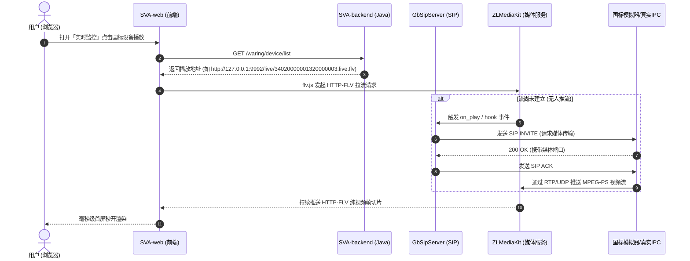
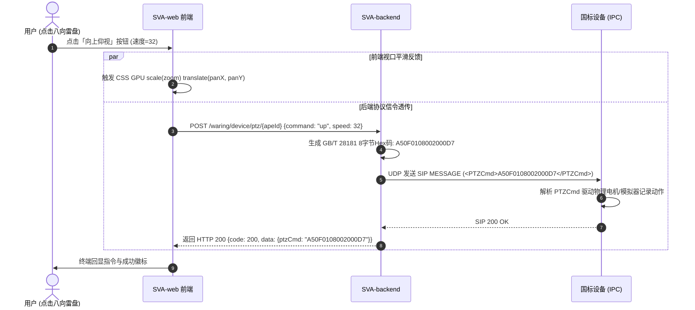
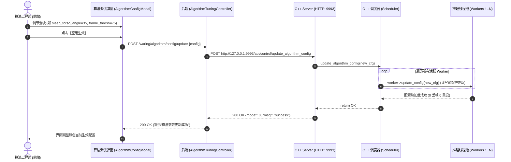
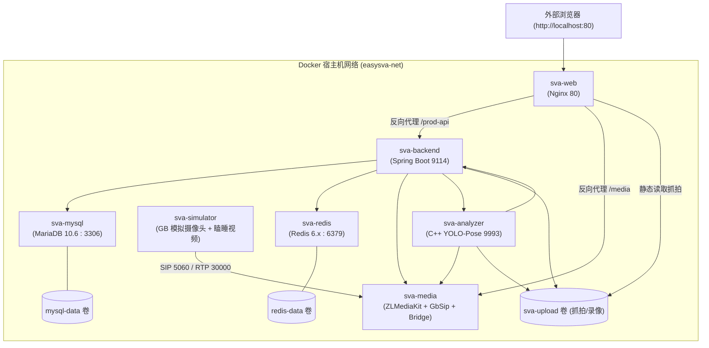

# easySVA 安全视频分析平台 - 总体架构设计说明书 (SAD)

**文档编号**：SVA-ARCH-2026-V2.5  
**编制团队**：easySVA 架构工程组  
**适用课程**：大三软件工程实训·企业应用设计实践（Hackathon 敏捷实战）  
**指导教师**：吴军、孙溢  
**当前版本**：v2.5  
**编写时间**：2026年9月  

---

## 一、 架构愿景与设计原则

easySVA 旨在打造一款**低延迟、高内聚、易扩展、软硬解耦**的轻量化工业级边缘 AI 视频分析中台。系统遵循以下架构原则：
1. **微服务与容器化解耦**：业务逻辑层（Java/Spring Boot）、媒体分发层（C++/ZLMediaKit）、智能分析层（C++/ONNX Runtime）与交互展示层（Vue.js）独立解耦，且全栈已实现 Docker 容器化微服务编排。
2. **异构协议适配中台化**：屏蔽安防硬件厂商差异，通过 GB/T 28181-2016、RTSP 双流网关以及工位电脑摄像头 WebM 中继网关抹平差异，为上层应用提供标准 HTTP-FLV / WebRTC / RTMP 流。
3. **算法超参数动态热更新 (Hot-Reload)**：分析引擎支持在线动态调节置信度、角度及持续帧数，避免因视场差异频繁重编译或重启服务。
4. **零延迟与时钟同步导向**：视频全链路贯穿 PES PTS 硬件级时间戳同步与 0 缓存编码管线，确保算法推理与人工监视毫秒级协同。
5. **弹性算力与绿色节能**：引入算法流按需唤醒与休眠策略，平衡算力消耗与实时监管需求。

---

## 二、 总体逻辑架构分层 (5-Tier Architecture)

系统在逻辑上清晰划分为 5 个层次：

```mermaid
graph TD
    subgraph L5["1. 前端交互展示层 (Web Presentation Tier)"]
        UI_Login["用户身份认证与权限导航"]
        UI_Device["设备管理 / 一键同步国标 / 电脑摄像头开关"]
        UI_Realtime["实时监控工作台 (1/4/9分屏)"]
        UI_PTZ["八向雷盘云台控制 + 电子PTZ"]
        UI_AlgoModal["算法参数动态热调节弹窗 (Hot-Reload Modal)"]
        UI_Task["布控任务排期与ROI多边形标定"]
        UI_Alarm["告警中心检索与证据链复核"]
    end

    subgraph L4["2. 业务协同与数据服务层 (Business Services Tier - Spring Boot)"]
        Gateway["REST API 路由网关 & JWT 拦截器"]
        DevService["设备管理服务 (DeviceSync / Status / OnlineSync)"]
        PtzService["国标 PTZ 8字节编码器 & UDP SIP 发送器"]
        AlgoService["算法超参数调控服务 (AlgorithmTuningController)"]
        TaskService["布控任务调度器 & 启停控制器"]
        AlarmService["告警事件接收/图片存盘/分发中心"]
        StreamService["按需推流节能控制器"]
        DB[(MySQL 8.0 / MariaDB 10.6)]
        Cache[(Redis 6.x 高速状态缓存)]
    end

    subgraph L3["3. 边缘 AI 视觉分析层 (AI Analytics Tier - C++17)"]
        ServerHttp["HTTP API 控制器 (:9993/api/control)"]
        Scheduler["多路分析调度器 (Scheduler)"]
        Workers["推理工作线程池 (Workers 1..N)"]
        Decoder["FFmpeg 硬件/多线程流解码器"]
        YoloPose["ONNX Runtime + YOLO-Pose 姿态关键点检测"]
        StateMachine["睡岗时序空间几何状态转移机"]
        AlarmUploader["告警截图片段合成与 HTTP 上报器"]
    end

    subgraph L2["4. 统一流媒体网关层 (Media Gateway Tier - ZLMediaKit)"]
        SipServer["GbSipServer (SIP 5060 信令交互与保活)"]
        RtpReceiver["RTP/PS 媒体接收与精确 PTS 提取器"]
        Bridge["gb_bridge_daemon.py 智能转桥守护进程"]
        WebcamRelay["webcam_bridge.py WebSocket 摄像头中继服务 (:18090)"]
        FlvDistributor["HTTP-FLV / WebRTC / RTMP 高性能分发引擎 (:9992/9994/9995)"]
    end

    subgraph L1["5. 感知设备层 (Perception & Emulation Tier)"]
        IPC_GB["GB28181 国标摄像机 (真实球机/枪机)"]
        IPC_RTSP["标准 RTSP 网络摄像机"]
        Sim1["设备1: 西门高精度国标球机模拟器 (SIP: 15060, RTP: 30000)"]
        Sim2["设备2: 工位电脑摄像头国标模拟器 (SIP: 15062, RTP: 30002)"]
    end

    L1 -->|"SIP注册 / RTP推流"| L2
    L2 -->|"RTSP/RTMP 流拉取"| L3
    L3 -->|"HTTP POST 告警事件"| L4
    L4 -->|"REST API / WebSocket"| L5
    L5 -->|"HTTP-FLV 拉流播放"| L2
    L5 -->|"POST /waring/device/ptz/{apeId}"| L4
    L4 -->|"UDP SIP MESSAGE <PTZCmd>"| L1
    L5 -->|"POST /waring/algorithm/config/update"| L4
    L4 -->|"POST /api/control/update_algorithm_config"| L3
```

---

## 三、 核心子系统与技术选型

| 模块名称 | 工程路径 | 技术栈 | 核心职责 |
| :--- | :--- | :--- | :--- |
| **SVA-web** | `/var/www/SVA-web` (开发) `sva-web` 容器 (Docker) | Vue 2.6, Element-UI, flv.js, ECharts, Axios | Web 交互大屏、九分屏监控、八向云台雷盘、算法参数调节弹窗、电脑摄像头推流、ROI 标定 |
| **SVA-backend** | `/opt/SVA/backend` (开发) `sva-backend` 容器 (Docker) | Java 8/11, Spring Boot 2.5, MyBatis, RuoYi 框架 | 系统核心业务微服务、设备上下线维护、PTZ 国标指令编码、算法参数热调中继、任务排期与告警入库 |
| **SVA-server** | `/opt/SVA/server` (开发) `sva-analyzer` 容器 (Docker) | C++17, CMake, FFmpeg 4.4, OpenCV 4.5, ONNX Runtime | 工业级实时视频解码、YOLO-Pose 推理、工位时序睡岗判定、参数在线热加载、告警合成与上报 |
| **SVA-mediaServer** | `/opt/SVA/mediaServer` (开发) `sva-media` 容器 (Docker) | C++, ZLMediaKit, libsip, librtp, POSIX Socket | GB28181 SIP 信令服务（5060）、RTP/PS 流解包、HTTP-FLV 媒体服务器 |
| **转桥守护服务** | `/opt/SVA/gb_bridge_daemon.py` | Python 3, FFmpeg, cURL, Requests | 双国标流在线状态感知转桥、解决 404/409 盲目点播刷屏、规整时间戳与断流自愈 |
| **电脑摄像头中继**| `/opt/SVA/webcam_bridge.py` | Python 3, WebSocket (:18090), FFmpeg | 接收浏览器工位摄像头 WebM 流，管道转换为 RTMP 推流至 ZLM，提供 SMPTE 彩条断流保护 |
| **双国标模拟器** | `gb28181_device_simulator.py` | Python 3, Socket, Threading, FFmpeg | 仿真设备 1 与设备 2 的 SIP 注册、心跳、目录查询、点播推流与 PTZ 指令响应 |

---

## 四、 关键数据流与拓扑交互设计

### 4.1 视频点播与播放全链路拓扑

### 4.2 国标 PTZ 云台控制信令链路

### 4.3 YOLO-Pose 算法超参数动态热重载链路 (Hot-Reload)

---

## 五、 物理网络部署与端口规划

| 端口号 | 协议 | 所属服务 | 用途说明 |
| :--- | :--- | :--- | :--- |
| **80 / 8888** | TCP (HTTP) | Nginx | 静态前端托管、API 反向代理及抓拍静态资源服务 |
| **9114** | TCP (HTTP) | SVA-backend (Java) | Spring Boot 业务主控 RESTful 接口 |
| **9993** | TCP (HTTP) | SVA-server (Analyzer)| C++ AI 算法控制接口（健康检查、参数热更新） |
| **5060** | UDP | GbSipServer | GB28181 SIP 信令交互端口（注册/心跳/INVITE/PTZ） |
| **18080** | TCP (HTTP) | GbSipServer | 国标信令服务内部管理 REST API（设备/通道/会话） |
| **9992** | TCP (HTTP) | ZLMediaKit | HTTP-FLV / WebRTC / REST API 流媒体分发主端口 |
| **9994** | TCP/UDP | ZLMediaKit | RTSP 流推拉端口 |
| **9995** | TCP | ZLMediaKit | RTMP 流推拉端口 |
| **18090** | TCP (WS) | webcam_bridge.py | 电脑摄像头 WebM 数据长连接接收端口 |
| **15060** | UDP | 设备1模拟器 | 西门球机本地 SIP 监听端口 |
| **15062** | UDP | 设备2模拟器 | 工位实景摄像头本地 SIP 监听端口 |
| **30000** | UDP | 设备1 RTP | 西门球机媒体推流源端口 |
| **30002** | UDP | 设备2 RTP | 工位实景摄像头媒体推流源端口 |
| **3306** | TCP | MySQL / MariaDB | 关系型业务数据存储（设备/任务/告警） |
| **6379** | TCP | Redis | 系统会话与设备状态高速缓存 |

---

## 六、 Docker 容器化微服务架构设计

为彻底消除由于 Linux/WSL 环境不一、工具链版本错配导致的交付部署困难，平台构建了基于 Docker Compose 的微服务容器拓扑：

### 6.1 容器协同与通信规范
1. **统一网络命名空间**：所有 7 个容器挂载于同一个 Docker 桥接网络 `easysva-net`，容器间直接利用服务名解析（如 `sva-mysql`、`sva-media`、`sva-analyzer`），杜绝 IP 硬编码。
2. **三级存储卷持久化**：
   - `mysql-data`：持久化 MySQL 表结构、设备记录及告警历史；
   - `redis-data`：持久化会话与状态缓存；
   - `sva-upload`：在 `sva-backend`、`sva-analyzer` 与 `sva-web` 之间共享，确保算法抓拍的现场图片可瞬间被后端记录并被前端 Nginx 访问展示。
3. **GPU 自适应回退**：`sva-analyzer` 镜像内置探测逻辑，若检测到 NVIDIA GPU 驱动则开启硬加速；若无显卡则自动降级使用 CPU `libx264` 软编码，输出日志提示并不中断服务。
