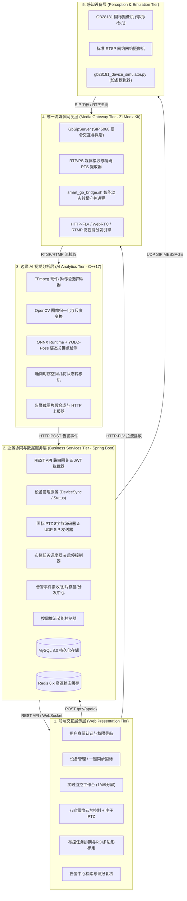
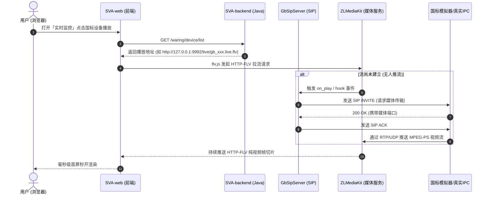
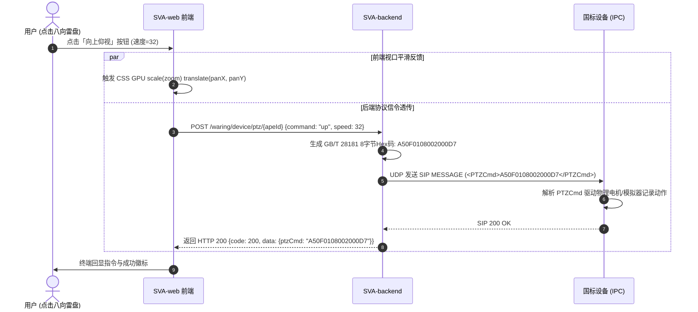

# easySVA 安全视频分析平台 - 总体架构设计说明书 (SAD)

**文档编号**：SVA-ARCH-2026-V2.5  
**编制团队**：easySVA 架构工程组  
**适用课程**：大三软件工程实训·企业应用设计实践（Hackathon 敏捷实战）  
**指导教师**：吴军、孙溢  
**当前版本**：v2.5  
**编写时间**：2026年9月  

---

## 一、 架构愿景与设计原则

easySVA 旨在打造一款**低延迟、高内聚、易扩展、软硬解耦**的轻量化工业级边缘 AI 视频分析中台。系统遵循以下架构原则：
1. **微服务与前后端分离**：业务逻辑层（Java/Spring Boot）、媒体分发层（C++/ZLMediaKit）、智能分析层（C++/ONNX Runtime）与交互展示层（Vue.js）独立解耦，具备高度技术自主性。
2. **异构协议适配中台化**：屏蔽安防硬件厂商差异，通过 GB/T 28181-2016 与 RTSP 双流网关抹平差异，为上层应用提供标准 HTTP-FLV / WebRTC / RTMP 流。
3. **零延迟与时钟同步导向**：视频全链路贯穿 PES PTS 硬件级时间戳同步与 0 缓存编码管线，确保算法推理与人工监视毫秒级协同。
4. **弹性算力与绿色节能**：引入算法流按需唤醒与休眠策略，平衡算力消耗与实时监管需求。

---

## 二、 总体逻辑架构分层 (5-Tier Architecture)

系统在逻辑上清晰划分为 5 个层次：

---

## 三、 核心子系统与技术选型

| 模块名称 | 工程路径 | 技术栈 | 核心职责 |
| :--- | :--- | :--- | :--- |
| **SVA-web** | `/var/www/SVA-web` | Vue 2.6, Element-UI, flv.js, ECharts, Axios | Web 交互大屏、九分屏监控、八向云台雷盘、ROI 标定、告警展示 |
| **SVA-backend** | `/opt/SVA/SVA-backend/ruoyi-admin` | Java 8/11, Spring Boot 2.5, MyBatis, RuoYi 框架 | 系统核心业务微服务、设备上下线维护、PTZ 国标指令编码、任务排期与告警入库 |
| **SVA-server** | `/opt/SVA/SVA-server` | C++17, CMake, FFmpeg 4.4, OpenCV 4.5, ONNX Runtime | 工业级实时视频解码、YOLO-Pose 推理、工位时序睡岗判定、告警合成与上报 |
| **SVA-mediaServer** | `/opt/SVA/mediaServer` | C++, ZLMediaKit, libsip, librtp, POSIX Socket | GB28181 SIP 信令服务（5060）、RTP/PS 流解包、HTTP-FLV 媒体服务器 |
| **转桥守护服务** | `/opt/SVA/smart_gb_bridge.sh` | Bash, FFmpeg, Python3, cURL | 国标流自适应探针、动态解码探测、滞回切换、时间戳规整 |
| **国标设备模拟器**| `/opt/SVA/.../gb28181_device_simulator.py` | Python 3, Socket, Threading, FFmpeg | 仿真 GB28181 设备注册、心跳、点播推流、PTZ 指令响应 |

---

## 四、 关键数据流与拓扑交互设计

### 4.1 视频点播与播放全链路拓扑

### 4.2 国标 PTZ 云台控制信令链路

---

## 五、 物理网络部署与端口规划

| 端口号 | 协议 | 所属服务 | 用途说明 |
| :--- | :--- | :--- | :--- |
| **80 / 8888** | TCP (HTTP) | Nginx | 静态前端托管、API 反向代理及流媒体负载分发 |
| **9114** | TCP (HTTP) | SVA-backend (Java) | Spring Boot 业务主控 RESTful 接口 |
| **5060** | UDP | GbSipServer | GB28181 SIP 信令交互端口（注册/心跳/INVITE/PTZ） |
| **19114** | TCP (HTTP) | GbSipServer | 国标信令服务内部管理 REST API（设备/通道/会话） |
| **9992** | TCP (HTTP) | ZLMediaKit | HTTP-FLV / WebRTC / REST API 流媒体分发主端口 |
| **9994** | TCP/UDP | ZLMediaKit | RTSP 流推拉端口 |
| **9995** | TCP | ZLMediaKit | RTMP 流推拉端口 |
| **15060** | UDP | Simulator (模拟器) | 模拟器本地 SIP 客户端监听端口 |
| **3306** | TCP | MySQL 8.0 | 关系型业务数据存储（设备/任务/告警） |
| **6379** | TCP | Redis | 系统会话与设备状态高速缓存 |

---

## 六、 架构高可用与自愈机制设计

1. **会话防泄漏与自动清场**：GbSipServer 内部由于异常断流可能遗留假死 Session，系统通过 `restart.sh` 与 `smart_gb_bridge.sh` 提供定期探针，断流后强制回收媒体端口，保障再次连接 100% 成功。
2. **两级智能流转桥决策**：
   - 一级判定（静态）：检测流封装及编码，非 H.264 则无条件转桥；
   - 二级判定（动态）：以 4 秒短周期试解码，检测时间戳单调性、丢帧数与解码异常；
   - 滞回机制：连续 3 轮判定结果一致才执行开启/关闭桥接，避免网络抖动导致进程高频振荡。
3. **分层监控看板 (`sva_monitor.sh` + `gb_monitor.sh`)**：分离系统级服务健康与国标协议细粒度信令状态，实现 0 开销的纯命令行实时态势感知。
