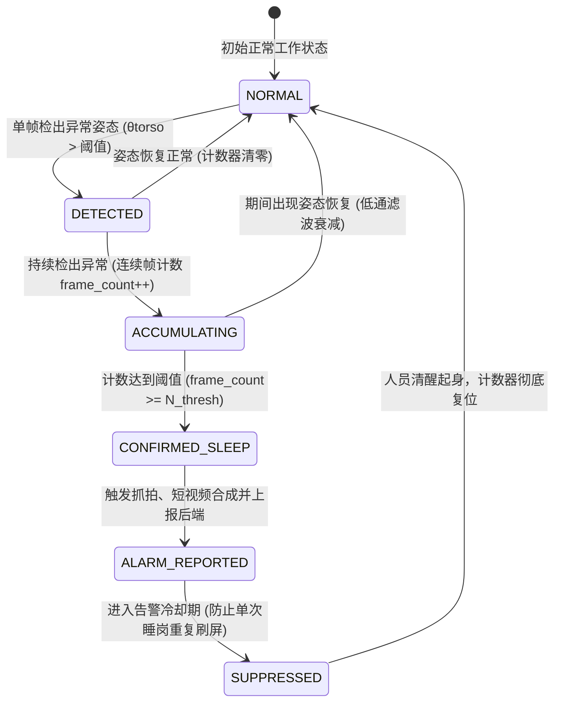

# easySVA 安全视频分析平台 - 详细设计说明书（算法与国标专项）

**文档编号**：SVA-ADD-2026-V2.5  
**编制团队**：easySVA AI 算法组 & 流媒体协议组  
**适用课程**：大三软件工程实训·企业应用设计实践（Hackathon 敏捷实战）  
**指导教师**：吴军、孙溢  
**当前版本**：v2.5  
**编写时间**：2026年9月  

---

# 第一部分：YOLO-Pose 工位睡岗行为检测算法设计

## 1. 算法背景与设计目标
工位睡岗检测是工业安防与安全生产的核心防线。传统方案常采用常规目标检测（如单纯人脸检测或人体边界框检测），在实际监控场景中面临严重局限：
- 员工正常低头敲代码、写字容易误判为睡岗；
- 人体俯身捡拾物品瞬间容易产生误告警；
- 遮挡、侧身以及背对摄像头时光照变化干扰剧烈。

本项目基于 **YOLO-Pose 单阶段多人体姿态估计网络**，结合**三维人体解剖学几何夹角建模**、**多帧时序空间状态消抖状态机**及**算法超参数在线热重载机制**，实现高灵敏度、低误报率且适应多场景的工业级睡岗行为识别。

---

## 2. 姿态特征向量提取与几何建模

### 2.1 关键点定义 (COCO 17 Keypoints)
模型输入经过预处理的视频图像帧（统一调整为 $640 	imes 640$ 分辨率），输出每个检出人员的 17 个骨骼关键点坐标 $(x_i, y_i)$ 及其置信度 $c_i \in [0, 1]$：
- $0$: 鼻子 (Nose)
- $1, 2$: 左右眼睛 (Left/Right Eye)
- $3, 4$: 左右耳朵 (Left/Right Ear)
- $5, 6$: 左右肩膀 (Left/Right Shoulder)
- $7, 8$: 左右肘部 (Left/Right Elbow)
- $9, 10$: 左右手腕 (Left/Right Wrist)
- $11, 12$: 左右髋部 (Left/Right Hip)
- $13, 14$: 左右膝盖 (Left/Right Knee)
- $15, 16$: 左右脚踝 (Left/Right Ankle)

```
        (0) Nose
       /         (1) L-Eye     (2) R-Eye
     |             |
 (3) L-Ear     (4) R-Ear
      \           /
       (5) L-Shldr ----- (6) R-Shldr
         |                 |
       (7) L-Elbw        (8) R-Elbw
         |                 |
       (9) L-Wrst       (10) R-Wrst
         |                 |
      (11) L-Hip  ----- (12) R-Hip
         |                 |
      (13) L-Knee       (14) R-Knee
         |                 |
      (15) L-Ankl       (16) R-Ankl
```

### 2.2 核心几何角度数学建模
1. **躯干倾斜角度 $	heta_{torso}$**：  
   取双肩中点 $P_{shoulder} = rac{P_5 + P_6}{2}$ 与双髋中点 $P_{hip} = rac{P_{11} + P_{12}}{2}$ 构建躯干向量 $ec{V}_{torso} = P_{shoulder} - P_{hip}$。  
   计算其与垂直向上向量 $ec{V}_{vertical} = (0, -1)$ 的夹角：
   $$	heta_{torso} = rccos\left( rac{ec{V}_{torso} \cdot ec{V}_{vertical}}{\|ec{V}_{torso}\| \|ec{V}_{vertical}\|} 
ight)$$
   当人员趴在桌面上睡岗时，躯干严重前倾或横卧，$	heta_{torso}$ 显著增大并超过阈值 $	heta_{torso\_thresh}$（默认 $45^\circ$）。

2. **头部低垂下俯角度 $	heta_{head}$**：  
   取头部关键点（鼻子 $P_0$ 或双耳中点）与双肩中点垂直距离，当头部高度逼近或低于双肩平面，且两眼水平距离收敛时，判定头部前倾低垂。

3. **屈膝与髋部夹角 $	heta_{knee}$**：  
   计算向量 $ec{V}_{thigh} = P_{knee} - P_{hip}$ 与 $ec{V}_{calf} = P_{ankle} - P_{knee}$ 的夹角，作为坐姿/卧姿的辅助验证。

---

## 3. 多帧时序空间消抖状态机

为了彻底消除瞬间低头、饮水、捡笔造成的误报，系统设计了多帧连续判定的滑动窗口状态机：



---

## 4. 算法超参数动态热重载机制 (Hot-Reload)

### 4.1 架构设计与并发安全
在实际生产运行中，不同监控点位的摄像机角度、安装高度及工位距离各异。传统写死静态参数或重启加载配置的方案会导致正在运行的布控分析中断。因此，系统实现了 **零中断参数热重载 (Hot-Reload)** 体系：

1. **配置数据结构体**：
   ```cpp
   struct AlgorithmConfig {
       float person_prob_threshold = 0.35f;       // 人体置信度门限
       float keypoint_threshold = 0.40f;          // 关键点有效门限
       float iou_threshold = 0.45f;               // NMS 重叠门限
       float sleep_torso_angle_thresh = 45.0f;    // 躯干倾角阈值(度)
       float sleep_hip_knee_angle_thresh = 50.0f; // 髋膝屈曲阈值(度)
       int sleep_frame_threshold = 75;            // 连续低头判定帧数
   };
   ```
2. **多线程安全分发**：
   - C++ Analyzer 主服务 `Server` 监听 `POST /api/control/update_algorithm_config`；
   - 调度器 `Scheduler` 接收到新配置后，加写锁保护全局默认配置，并遍历当前所有活跃的分析 Worker；
   - 每个 `Worker` 在处理视频帧的间隔，通过 `worker->update_config(new_config)` 将新参数热加载至 `AlgorithmOnYoloPose` 实例；
   - 参数更新全程耗时 $< 5	ext{ms}$，不涉及模型重载或管道重建，达到绝对的“零丢帧、零抖动、零重启”。

---

# 第二部分：GB/T 28181 国标协议接入与云台控制专项设计

## 5. GB28181 SIP 信令交互与会话管理

系统基于 SIP 协议（RFC 3261）和 GB/T 28181-2016 规范实现国标接入：
- **注册流程 (REGISTER)**：设备上电后向 GbSipServer（UDP 5060）发起注册；若开启鉴权，服务器回送 `401 Unauthorized` 携带随机 `nonce` 与 `realm`，设备计算 MD5 Digest 摘要后重发 `REGISTER`，服务器校验通过回送 `200 OK`。
- **心跳机制 (Keepalive)**：设备每 15 秒上报 XML 心跳；服务器维护倒计时，超过 45 秒无心跳自动将设备置为离线。
- **点播流程 (INVITE)**：用户请求视频时，GbSipServer 动态分配 RTP 端口并通过 SIP INVITE 携带 SDP 协商；设备回送 200 OK 后通过 UDP 向指定端口推送 PS-RTP 流。

---

## 6. 双路独立国标通道与电脑摄像头实景接入设计

系统构建了双路独立并发的国标设备接入体系：
1. **设备 1（西门高精度国标球机）**：
   - 国标编码：`34020000001320000001`，通道编码：`34020000001320000002_0100000016`；
   - 本地 SIP 端口：`15060`，媒体推流源端口：`30000`；
   - 视频源：采用高精度瞌睡测试视频源，用于睡岗算法精准闭环验证。
2. **设备 2（工位实景国标摄像头）**：
   - 国标编码：`34020000001320000003`，通道编码：`34020000001320000003_0100000018`；
   - 本地 SIP 端口：`15062`，媒体推流源端口：`30002`；
   - 视频源：由前端浏览器开启本地摄像头通过 WebSocket (`:18090`) 发送 WebM 流，由 `webcam_bridge.py` 转化为 RTMP，再由国标模拟器封装为 PS-RTP 注入国标服务器。
   - 自愈彩条保护：当工位电脑离开或关闭摄像头时，自动回退至 25fps SMPTE 标准测试彩条，保证流媒体服务永不断流。

---

## 7. GB28181 云台 PTZ 8 字节 Hex 控制指令封包规范

系统严格遵循 GB/T 28181-2016 附录 A 对云台指令进行二进制封包：
- **报文格式 (8 字节十六进制)**：
  - **Byte 1**：首字节，固定为 `0xA5`；
  - **Byte 2**：版本与校验标识，固定为 `0x0F`；
  - **Byte 3**：设备地址码，固定为 `0x01`；
  - **Byte 4**：控制指令码（高4位云台控制，低4位镜头变焦）：
    - `0x08`：向上仰视 (Tilt Up)
    - `0x04`：向下俯视 (Tilt Down)
    - `0x02`：向左旋转 (Pan Left)
    - `0x01`：向右旋转 (Pan Right)
    - `0x0A`：左上 (Up-Left)
    - `0x09`：右上 (Up-Right)
    - `0x06`：左下 (Down-Left)
    - `0x05`：右下 (Down-Right)
    - `0x10`：镜头放大 (Zoom In)
    - `0x20`：镜头缩小 (Zoom Out)
    - `0x00`：停止动作 (Stop)
  - **Byte 5**：水平速度，取值范围 `0x00` ~ `0xFF`（默认 `0x20` 即 32 档）；
  - **Byte 6**：垂直速度，取值范围 `0x00` ~ `0xFF`（默认 `0x20` 即 32 档）；
  - **Byte 7**：变焦速度，取值范围 `0x00` ~ `0x0F`（默认 `0x00`）；
  - **Byte 8**：校验码 (Checksum)，计算前 7 字节累加和取模：
    $$	ext{Checksum} = \left(\sum_{i=1}^{7} 	ext{Byte}_i
ight) \pmod{256}$$

- **XML 封装示例**：
  ```xml
  <?xml version="1.0" encoding="GB2312"?>
  <Control>
    <CmdType>DeviceControl</CmdType>
    <SN>100234</SN>
    <DeviceID>34020000001320000001</DeviceID>
    <PTZCmd>A50F0108002000D7</PTZCmd>
  </Control>
  ```
