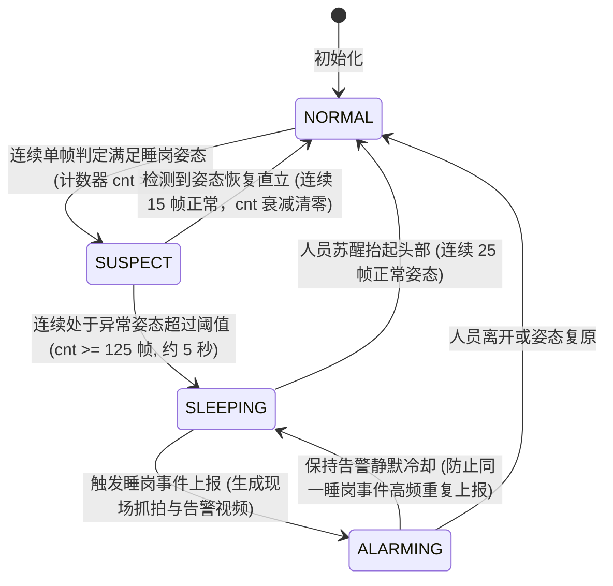
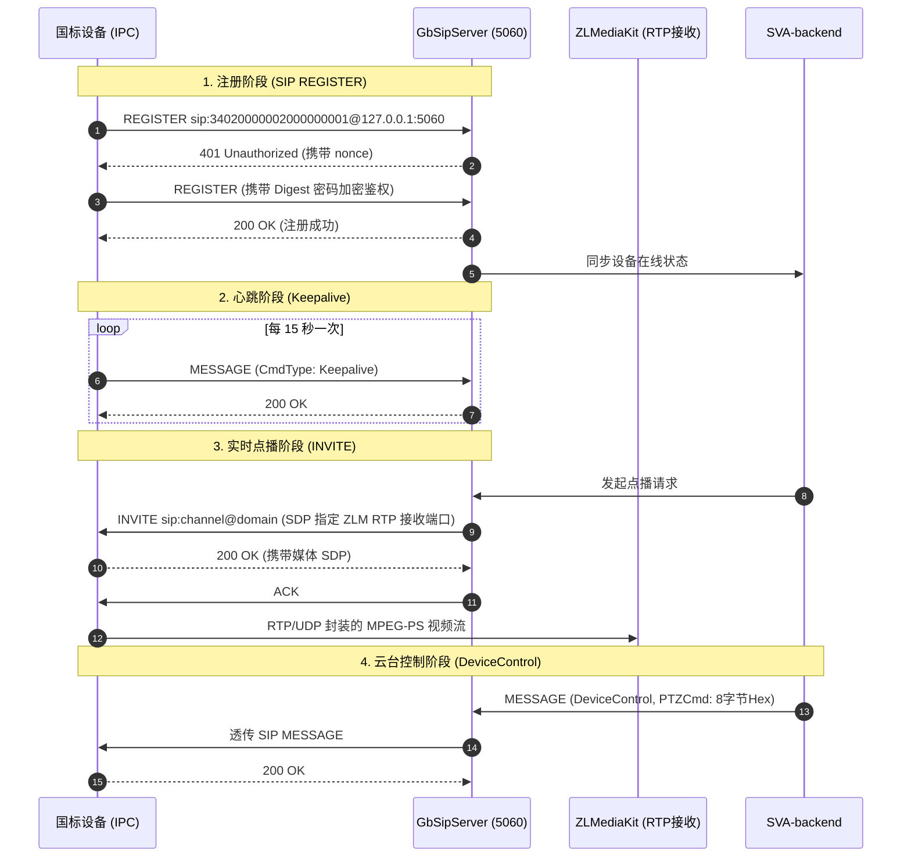

# easySVA 安全视频分析平台 - 详细设计说明书（算法与国标专项）

**文档编号**：SVA-ADD-2026-V2.5  
**编制团队**：easySVA AI 算法组 & 流媒体协议组  
**适用课程**：大三软件工程实训·企业应用设计实践（Hackathon 敏捷实战）  
**指导教师**：吴军、孙溢  
**当前版本**：v2.5  
**编写时间**：2026年9月  

---

# 第一部分：YOLO-Pose 工位睡岗行为检测算法设计

## 1. 算法背景与设计目标
工位睡岗检测是工业安防与安全生产的核心防线。传统方案常采用常规目标检测（如单纯人脸检测或人体边界框检测），在实际监控场景中面临严重的局限性：
- 员工正常低头敲代码、写字容易误判为睡岗；
- 人体俯身捡拾物品瞬间容易产生误告警；
- 遮挡、侧身以及背对摄像头时光照变化干扰剧烈。

本项目基于 **YOLO-Pose 单阶段多人体姿态估计网络**，结合**三维人体解剖学几何夹角建模**与**多帧时序空间状态消抖算法**，实现高灵敏度、低误报率的工业级睡岗行为识别。

---

## 2. 姿态特征向量提取与几何建模

### 2.1 关键点定义 (COCO 17 Keypoints)
模型输入经过预处理的视频图像帧（统一调整为 $640 \times 640$ 分辨率），输出每个检出人员的 17 个骨骼关键点坐标 $(x_i, y_i)$ 及其置信度 $c_i \in [0, 1]$：
- $0$: 鼻子 (Nose)
- $1, 2$: 左右眼睛 (Left/Right Eye)
- $3, 4$: 左右耳朵 (Left/Right Ear)
- $5, 6$: 左右肩膀 (Left/Right Shoulder)
- $7, 8$: 左右肘部 (Left/Right Elbow)
- $9, 10$: 左右手腕 (Left/Right Wrist)
- $11, 12$: 左右髋部 (Left/Right Hip)
- $13, 14$: 左右膝盖 (Left/Right Knee)
- $15, 16$: 左右脚踝 (Left/Right Ankle)

```
        (0) Nose
       /        \
   (1)LEye     (2)REye
     |           |
   (3)LEar     (4)REar
      \         /
    (5)LShoulder ---- (6)RShoulder
        |     \     /    |
        |    (Neck)      |
    (7)LElbow          (8)RElbow
        |                  |
    (9)LWrist          (10)RWrist
        |                  |
    (11)LHip --------- (12)RHip
```

### 2.2 核心姿态几何判据
算法定义 3 大空间几何指标联合判定当前帧是否呈现“睡岗俯卧/沉睡姿态”：

1. **头肩相对垂直压缩比 ($R_{hs}$)**：
   $$\text{Mid\_Shoulder} = \left( \frac{x_5 + x_6}{2}, \frac{y_5 + y_6}{2} \right)$$
   $$D_{hs} = \text{Mid\_Shoulder}_y - y_0$$
   $$H_{torso} = \left\| \text{Mid\_Shoulder} - \text{Mid\_Hip} \right\|_2$$
   $$R_{hs} = \frac{D_{hs}}{H_{torso}}$$
   - **判定准则**：当人员正常坐立时，$D_{hs} > 0$ 且 $R_{hs} > 0.35$；当人员低头趴桌、下颌触胸或头部低垂时，$R_{hs} < 0.15$ 甚至 $D_{hs} \le 0$（鼻子水平线低于或齐平于肩膀）。

2. **躯干倾斜角度 ($\theta_{torso}$)**：
   计算脊柱向量 $\vec{V}_{spine} = \text{Mid\_Shoulder} - \text{Mid\_Hip}$ 与铅垂线向量 $\vec{V}_{vertical} = (0, -1)$ 的夹角：
   $$\theta_{torso} = \arccos\left( \frac{\vec{V}_{spine} \cdot \vec{V}_{vertical}}{\|\vec{V}_{spine}\|} \right)$$
   - **判定准则**：正常端坐时 $\theta_{torso} < 25^\circ$；趴在桌面上睡岗时，躯干严重前倾或侧倾，$\theta_{torso} > 50^\circ$。

3. **双耳-双肩夹角与面部可视度**：
   当左右耳在垂直轴上快速向下位移，且置信度 $c_{eye}, c_{nose}$ 骤降（面部朝下贴着桌面被遮挡），结合双肩横向距离，判定进入伏案姿态。

---

## 3. 多帧时序状态机与抗干扰滤波 (State Machine)

为了彻底杜绝“喝水、系鞋带、看手机、捡物品”等瞬态行为带来的误报，算法设计了**基于滑动时间窗口的时序状态机**：



### 时序参数调优配置
- **采样帧率**：$25\text{ FPS}$
- **瞬态抖动容忍窗口**：$30\text{ 帧} (1.2\text{s})$。若在此窗口内姿态回正，计数器立即衰减归零。
- **确诊确认阈值**：$125\text{ 帧} (5.0\text{s})$。持续 5 秒低头趴桌才确诊睡岗。
- **告警冷却周期**：$60\text{s}$。同一个人在同工位持续处于睡岗状态，每隔 60 秒上报一次提醒，避免打爆数据库与消息通知。

---

# 第二部分：GB/T 28181-2016 国标协议与云台控制专项设计

## 1. 国标协议全生命周期状态流转
GB/T 28181 规定了公共安全视频监控的统一联网体系，控制面走 SIP（Session Initiation Protocol）协议，数据面走 RTP/PS 协议。



---

## 2. PS 流精确时间戳 (PES PTS) 提取设计

### 2.1 传统合成时间戳的痛点
原模拟器代码按数据包计数累加时间戳：
`timestamp = pack_index * (90000 / frame_rate)`
然而 FFmpeg 产生的 MPEG-PS 流中，一个视频帧可能切分为多个 PS 包，导致 RTP 时间戳严重抖动与超前跳跃，使得前端 flv.js 播放器无法建立稳定时钟，产生持续性的**音视频时钟失步与周期性画面假死卡顿**。

### 2.2 真实 33 位 PES PTS 解析实现
在 `gb28181_device_simulator.py` 中重构了数据帧探测算法，直接从 PES 扩展头部提取硬件精准显示时间戳（PTS）：
```python
def extract_pts(pack: bytes) -> Optional[int]:
    # 查找视频 PES 起始码 0x000001E0 ~ 0x000001EF
    pos = pack.find(b"\x00\x00\x01\xe2")
    if pos < 0:
        pos = pack.find(b"\x00\x00\x01\xe0")
    if pos >= 0 and len(pack) > pos + 14:
        flags = pack[pos + 7]
        # 判断 PTS_DTS_flags 标志位是否包含 PTS (二进制 10 或 11)
        if ((flags >> 6) & 0x03) in (2, 3):
            p = pack[pos + 9 : pos + 14]
            # 提取 33 位无符号整型时间戳 (90kHz 时钟基准)
            return (((p[0] >> 1) & 0x07) << 30) | (p[1] << 22) | \
                   (((p[2] >> 1) & 0x7F) << 15) | (p[3] << 7) | (p[4] >> 1)
    return None
```
将提取出的 `current_pts` 直接填充至 RTP Header 的 Timestamp 字段中，保证了时间戳绝对严格连续递增，从源头消除了视频卡顿。

---

## 3. GB/T 28181-2016 标准 8 字节云台控制指令设计

### 3.1 8 字节十六进制指令编码规范
国标云台控制指令固定为 8 个字节（Byte 1 ~ Byte 8），其物理含义如下：

| 字节位置 | 字段名称 | 字节取值 (Hex) | 字段说明与规则 |
| :---: | :--- | :---: | :--- |
| **Byte 1** | 首字节同步码 | `0xA5` | 固定同步头码，代表国标控制信令 |
| **Byte 2** | 版本与校验码 | `0x0F` | 高4位为版本号(0x0)，低4位为保留校验位(0xF) |
| **Byte 3** | 地址码 / 通道 | `0x01` | 对应前端摄像机/球机的控制通道号（默认通道1） |
| **Byte 4** | **指令控制码** | 见下方指令表 | 决定云台动作：上下左右、变焦拉伸、停止制动 |
| **Byte 5** | 水平旋转速度 | `0x00 ~ 0xFF` | Pan 速度级别：取值 0~255，值越大旋转越快 |
| **Byte 6** | 垂直旋转速度 | `0x00 ~ 0xFF` | Tilt 速度级别：取值 0~255，值越大仰俯越快 |
| **Byte 7** | 变焦拉伸速度 | `0x00 ~ 0xF0` | Zoom 速度级别：高 4 位有效（0~15） |
| **Byte 8** | **累加和校验码** | `CheckSum` | **前 7 字节累加和取模 256**：`Sum(B1..B7) & 0xFF` |

### 3.2 常见云台动作与指令码对照表
| 动作指令 (Command) | 指令码 Byte 4 (Hex) | 二进制位定义 (Bit7~Bit0) | 典型指令样例 (速度=32/0x20) |
| :--- | :---: | :---: | :---: |
| **停止 (Stop)** | `0x00` | `0000 0000` | `A50F0100000000B5` |
| **向上仰视 (Up)** | `0x08` | `0000 1000` | `A50F0108002000D7` |
| **向下俯视 (Down)** | `0x04` | `0000 0100` | `A50F0104002000D3` |
| **向左旋转 (Left)** | `0x02` | `0000 0010` | `A50F0102200000D1` |
| **向右旋转 (Right)** | `0x01` | `0000 0001` | `A50F0101200000D0` |
| **左上 (UpLeft)** | `0x0A` | `0000 1010` | `A50F010A202000F9` |
| **右上 (UpRight)** | `0x09` | `0000 1001` | `A50F0109202000F8` |
| **左下 (DownLeft)** | `0x06` | `0000 0110` | `A50F0106202000F5` |
| **右下 (DownRight)** | `0x05` | `0000 0101` | `A50F0105202000F4` |
| **镜头放大 (Zoom In)** | `0x10` | `0001 0000` | `A50F0110000020DB` |
| **镜头缩小 (Zoom Out)**| `0x20` | `0010 0000` | `A50F0120000020EB` |

### 3.3 编码算法核心代码实现 (Java)
在 `HDeviceServiceImpl.java` 中算法严格执行如下运算逻辑：
```java
public String buildPtzCmd(String command, int speed) {
    int b1 = 0xA5;
    int b2 = 0x0F;
    int b3 = 0x01;
    int b4 = 0x00;
    int b5 = 0x00; // pan speed
    int b6 = 0x00; // tilt speed
    int b7 = 0x00; // zoom speed (high 4 bits)

    switch (command.toLowerCase()) {
        case "up":        b4 = 0x08; b6 = speed; break;
        case "down":      b4 = 0x04; b6 = speed; break;
        case "left":      b4 = 0x02; b5 = speed; break;
        case "right":     b4 = 0x01; b5 = speed; break;
        case "upleft":    b4 = 0x0A; b5 = speed; b6 = speed; break;
        case "upright":   b4 = 0x09; b5 = speed; b6 = speed; break;
        case "downleft":  b4 = 0x06; b5 = speed; b6 = speed; break;
        case "downright": b4 = 0x05; b5 = speed; b6 = speed; break;
        case "zoomin":    b4 = 0x10; b7 = ((speed >> 4) & 0x0F) << 4; break;
        case "zoomout":   b4 = 0x20; b7 = ((speed >> 4) & 0x0F) << 4; break;
        case "stop":
        default:          b4 = 0x00; break;
    }
    // 计算前7字节累加和取模 256
    int checkSum = (b1 + b2 + b3 + b4 + b5 + b6 + b7) & 0xFF;
    return String.format("%02X%02X%02X%02X%02X%02X%02X%02X", 
                         b1, b2, b3, b4, b5, b6, b7, checkSum);
}
```

### 3.4 SIP XML 控制载荷封装
生成的 8 字节 Hex 串封装入 XML 报文：
```xml
<?xml version="1.0" encoding="GB2312"?>
<Control>
  <CmdType>DeviceControl</CmdType>
  <SN>839201</SN>
  <DeviceID>34020000001320000002</DeviceID>
  <PTZCmd>A50F0108002000D7</PTZCmd>
  <Info>
    <ControlPriority>5</ControlPriority>
  </Info>
</Control>
```
通过 UDP Socket 向设备监听端口（15060）投递 SIP `MESSAGE` 信令，实现工业标准的无缝闭环。
