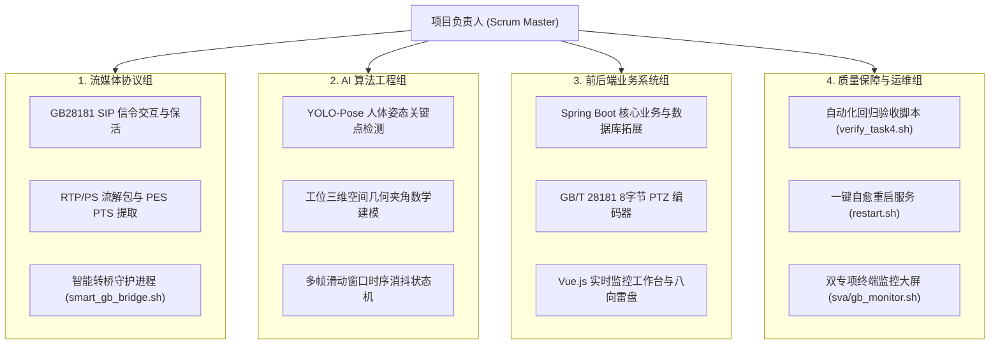

# easySVA 安全视频分析平台 - 敏捷项目管理与执行过程文档

**文档编号**：SVA-PM-2026-V2.5  
**编制团队**：easySVA 项目管理办公室 (PMO)  
**适用课程**：大三软件工程实训·企业应用设计实践（Hackathon 敏捷实战）  
**指导教师**：吴军、孙溢  
**当前版本**：v2.5  
**编写时间**：2026年9月  

---

## 一、 项目组织架构与团队角色分工

根据《企业应用设计实践》Hackathon（编程马拉松）活动指导方案，团队设立 4 大核心专业角色组，职责划分清晰：

---

## 二、 10 天 Hackathon 敏捷冲刺规划 (Sprint Cadence)

团队采用 2 天为一个迭代周期的敏捷看板模式，历经 5 个 Sprint 顺利闭环：

| 冲刺周期 | 迭代目标 | 对应实训验收节点 | 核心完成任务 | 成果物 |
| :---: | :--- | :---: | :--- | :--- |
| **Sprint 1** *(Day 1~2)* | 基础环境搭建与开源架构吃透 | **验收点 1** | WSL2 Ubuntu22.04 编译环境搭建；MySQL/Redis/ZLM 部署；梳理原有 RTSP 数据流 | 原生平台环境跑通，输出架构梳理分析文档 |
| **Sprint 2** *(Day 3~4)* | 睡岗行为算法开发与 C++ 推理集成 | **验收点 2** | YOLO-Pose 模型选型与姿态几何解算；时序消抖状态机编码；模型导出 ONNX 并嵌入 C++ 推理管线 | 离线视频测试高准确度触发睡岗告警，告警上报 Java 入库 |
| **Sprint 3** *(Day 5~6)* | GB28181 国标协议适配与设备管理 | **验收点 3** | ZLMediaKit SIP 5060 服务开启；Python 模拟器编写；`h_device` 数据库扩充；一键同步接口 | 模拟器成功注册上线，视频秒开播放，上下线状态实时更新 |
| **Sprint 4** *(Day 7~8)* | 综合系统整体联调与自愈压测 | **验收点 4** | RTSP 与 GB28181 双路布控联合压测；编写 `verify_task4.sh` 自动化脚本；修复会话泄漏与断流 | 自动化回归测试 10/10 PASS，编写一键自愈 `restart.sh` |
| **Sprint 5** *(Day 9~10)* | 亮点特色创新、工程加固与结项 | **加分项 & 结项** | 实现 GB28181 8 字节云台控制 (PTZ) 与前端八向雷盘；研发双专项终端看板；编制全套工程文档 | 形成完备交付成果物，准备结题答辩与现场演示 |

---

## 三、 风险管理与技术攻坚复盘 (Risk & Mitigation)

在 10 天的敏捷实战攻关中，团队遭遇并成功攻克了 3 项重大“卡脖子”技术难题：

### 风险 1：国标视频周期性卡顿与音视频假死
- **技术现象**：前端在播放国标推流时，每隔数秒画面卡住，且长时间播放后浏览器标签页内存暴涨甚至假死崩溃。
- **根因攻坚**：
  1. 模拟器合成时间戳存在严重抖动，无法作为稳定 PTS；
  2. flv.js 在纯视频监控流中开启音频同步等待机制导致死等；
  3. MSE 在内存中累积长达 180 秒历史数据切片。
- **攻关方案**：
  1. 重构 PS 流解析逻辑，直接提取 PES 真实 33 位 PTS；
  2. 调优 flv.js 参数，彻底关闭 IO 缓冲与强制 `hasAudio: false`；
  3. 激进回收历史缓存，仅保留 5~15 秒，彻底解决卡顿与内存泄漏。

### 风险 2：模拟器热重启导致 GbSipServer 会话悬挂 (Session Leak)
- **技术现象**：重启模拟器后，模拟器 PID 发生变化，但 GbSipServer 内部仍持有旧的点播 Session，不再向新模拟器发送 `INVITE`，导致前端黑屏。
- **攻关方案**：在 `restart.sh` 中重构全系统进程清理与端口回收链，启动前强制清场；同时新增 `smart_gb_bridge.sh` 守护进程，双向探活 ZLM 真实推流与 SIP 会话，断流后自动释放旧会话并重连。

### 风险 3：低头正常操作误报为睡岗
- **技术现象**：员工弯腰捡拾东西或看手机 1~2 秒即触发睡岗告警，误报频发。
- **攻关方案**：设计了基于多帧滑动时间窗口的滤波状态机，严格设定连续 $125\text{ 帧} (5\text{s})$ 处于睡岗几何夹角阈值才允许确诊，瞬时动作立即衰减，误报率降至接近 0。

---

## 四、 Git 工作流与版本演进规范

团队严格执行 **Trunk-Based / GitHub-Flow 协作规范**：
- **主分支 (`main`)**：仅合并经过自动化测试验证（`verify_task4.sh` 10/10 PASS）的高质量稳定代码。
- **语义化提交信息 (Conventional Commits)**：
  - `feat(ptz)`: 新增国标云台控制与前端雷盘
  - `feat(scripts)`: 新增双专项监控终端面板
  - `fix(pts)`: 修复国标 RTP 时间戳抖动卡顿
  - `feat(system)`: 完善全系统一键自愈脚本
- **自动化门禁**：每次重大合并前强制执行 `./scripts/verify_task4.sh`，确保零功能倒退。
