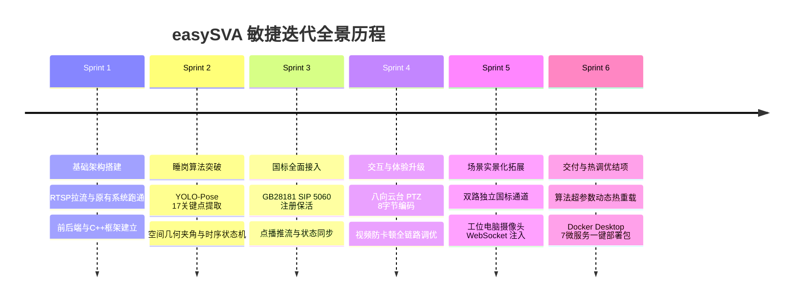

# easySVA 安全视频分析平台 - 敏捷项目管理与执行过程文档

**文档编号**：SVA-PM-2026-V2.5  
**编制团队**：easySVA 项目管理办公室 (PMO)  
**适用课程**：大三软件工程实训·企业应用设计实践（Hackathon 敏捷实战）  
**指导教师**：吴军、孙溢  
**当前版本**：v2.5  
**编写时间**：2026年9月  

---

## 一、 团队组织架构与分工矩阵

依据软件工程实训与企业级敏捷开发规范，团队设立 4 大专业协同组，落实职责到人：

| 专业角色组 | 核心成员 | 主要职责与交付模块 |
| :--- | :--- | :--- |
| **流媒体协议组** | 流媒体架构师 | GB28181 SIP 信令交互、RTP/PS 解包、转桥守护 (`gb_bridge_daemon.py`)、电脑摄像头中继 |
| **AI 算法工程组**| 算法工程师 | YOLO-Pose 模型集成、睡岗空间几何建模、时序状态机、算法参数动态热重载体系 |
| **全栈业务工程组**| 业务全栈工程师 | Spring Boot 业务中台、PTZ 8 字节编码器、Vue 前端监控大屏、算法调优弹窗 |
| **质量与持续交付组**| DevOps / QA | Docker 微服务编排与镜像打包（`easySVA-部署包`）、自动化回归测试套件、运维脚本库 |

---

## 二、 敏捷冲刺迭代历程 (Sprint History)

---

## 三、 完整课程交付物清单矩阵

| 序号 | 交付物名称 | 交付形式 / 路径 | 核心内容与价值 |
| :---: | :--- | :--- | :--- |
| **01** | **需求规格说明书** | `01_需求文档.md` | 功能性（FR-GB/POSE/PTZ/ALGO/DOCKER）与非功能性需求 |
| **02** | **总体架构设计说明书** | `02_架构设计文档.md` | 5 层逻辑分层、Docker 7 微服务拓扑、热重载时序图与端口拓扑 |
| **03** | **详细设计说明书（算法与国标）** | `03_设计文档_算法与国标.md` | YOLO-Pose 几何数学模型、Hot-Reload 并发安全、8 字节 Hex 封包规范 |
| **04** | **接口规范说明书** | `04_接口文档.md` | 设备、PTZ、布控告警、算法动态参数调优及 WebSocket 推流接口 |
| **05** | **系统部署与运维手册** | `05_部署文档_含部署手册.md` | **Docker Desktop 一键免编译部署**与 Linux/WSL 原生开发双轨指南 |
| **06** | **测试方案与测试报告** | `06_测试文档.md` | 15 项端到端自动化测试矩阵，覆盖睡岗、国标、PTZ 及 Docker |
| **07** | **敏捷项目管理文档** | `07_项目管理文档.md` | 团队分工、Sprint 冲刺复盘与风险控制分析 |
| **08** | **系统使用手册** | `08_使用手册.md` | 用户图文操作手册，含算法调优弹窗、电脑摄像头、云台控制实操 |
| **09** | **系统架构图集** | `09_架构图.md` | 10 张高清 Mermaid 架构图（总体、Docker、数据流、SIP、PTZ等） |
| **10** | **系统运维与排障脚本手册** | `10_系统运维与排障脚本手册.md`| 涵盖自愈重启、双国标上下线控制、转桥守护、抓包与排障全指南 |
| **PKG**| **Docker 一键免编译部署包** | `C:\Users\34964\Desktop\easySVA-部署包` | 7 微服务镜像 (`easysva-images-v1.0.tar`) + Compose 编排，开箱即用 |
