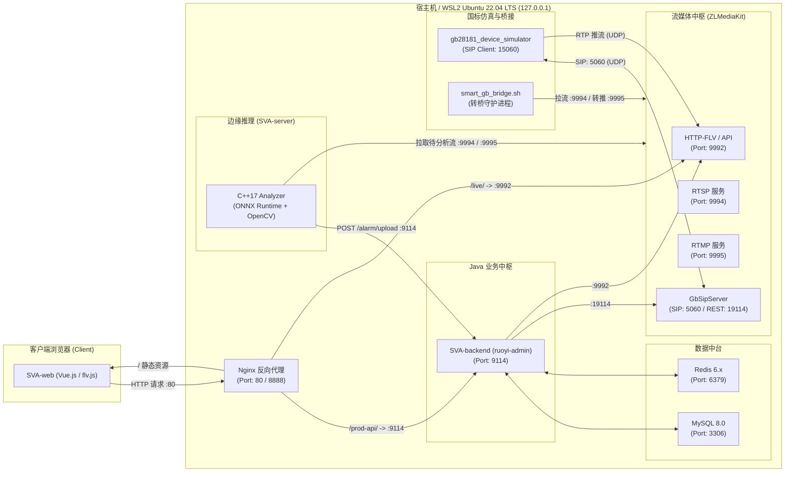
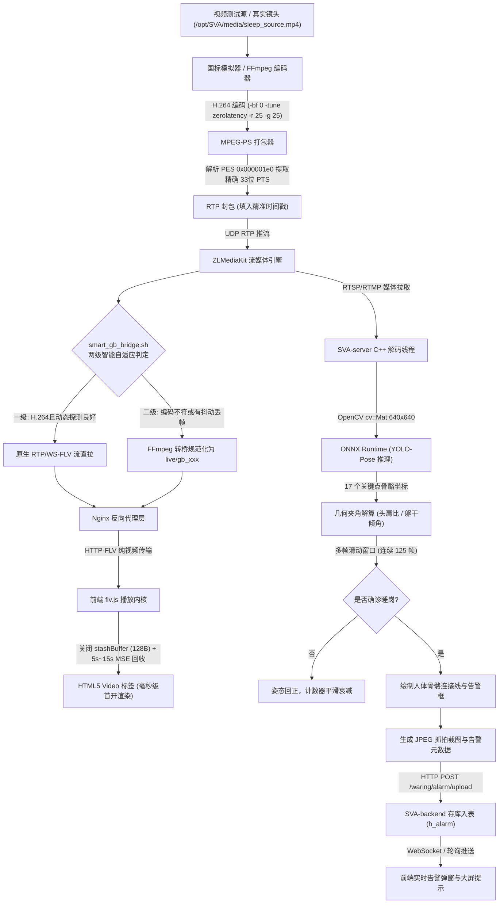
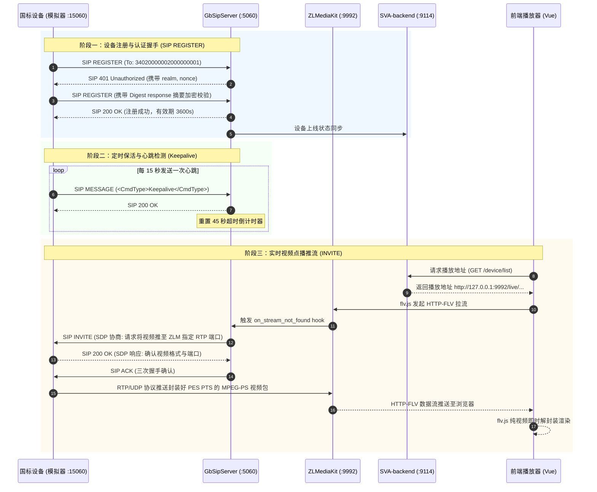
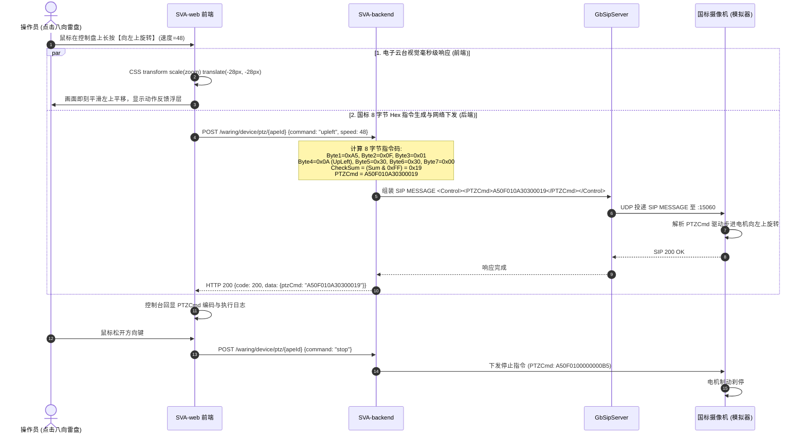
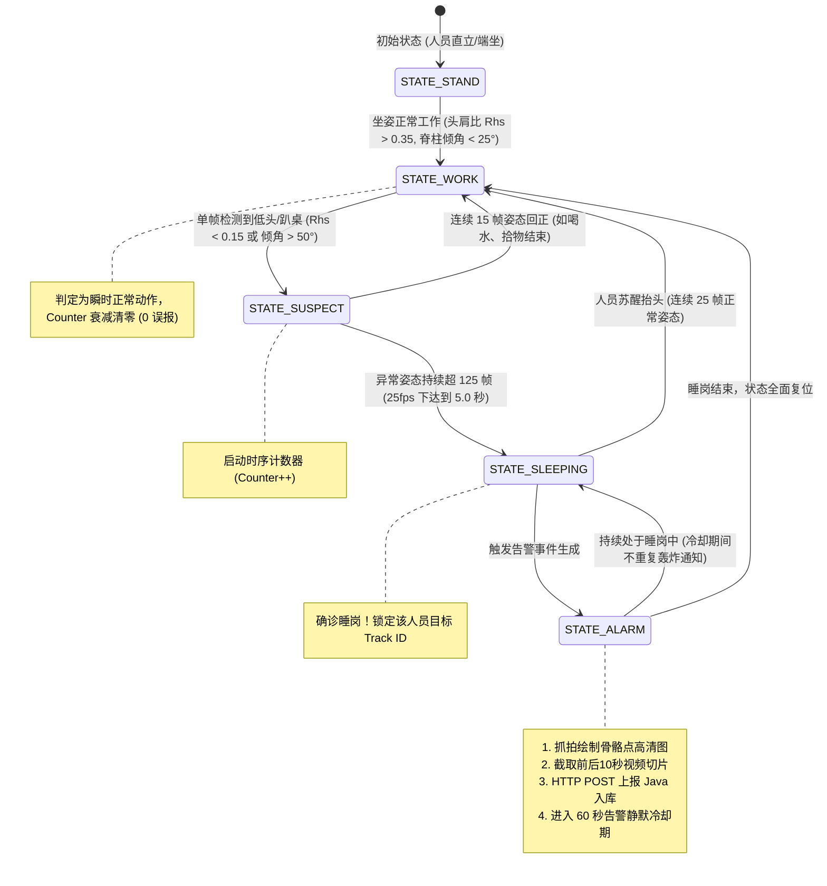

# easySVA 安全视频分析平台 - 系统全景与核心架构图集

**文档编号**：SVA-DIAG-2026-V2.5  
**编制团队**：easySVA 架构工程组  
**适用课程**：大三软件工程实训·企业应用设计实践（Hackathon 敏捷实战）  
**指导教师**：吴军、孙溢  
**当前版本**：v2.5  
**编写时间**：2026年9月  

---

## 目录索引
- [图 1：系统总体逻辑分层架构图](#图-1系统总体逻辑分层架构图)
- [图 2：系统物理部署与网络拓扑图](#图-2系统物理部署与网络拓扑图)
- [图 3：端到端视频流转与 AI 推理数据流图](#图-3端到端视频流转与-ai-推理数据流图)
- [图 4：GB/T 28181 注册、保活与点播信令时序图](#图-4gbt-28181-注册保活与点播信令时序图)
- [图 5：GB/T 28181 标准八向云台控制 (PTZ) 交互时序图](#图-5gbt-28181-标准八向云台控制-ptz-交互时序图)
- [图 6：YOLO-Pose 睡岗姿态识别多帧时序状态转移图](#图-6yolo-pose-睡岗姿态识别多帧时序状态转移图)
- [图 7：视频卡顿与低延迟端到端全链路优化架构图](#图-7视频卡顿与低延迟端到端全链路优化架构图)

---

### 图 1：系统总体逻辑分层架构图

```mermaid
graph TD
    subgraph ClientLayer["1. 用户交互与前端展现层 (Presentation Layer)"]
        V_Login["身份鉴权与路由导航"]
        V_Device["设备列表 / 国标一键同步"]
        V_Monitor["实时视频九分屏监控墙"]
        V_PTZ["八向雷盘云台控制器 (Digital PTZ)"]
        V_Deploy["睡岗布控排期与ROI多边形标定"]
        V_Alarm["实时告警中心与证据链核查"]
        V_Screen["数据可视化综合监控大屏"]
    end

    subgraph ServiceLayer["2. 业务协同与微服务层 (Application Service Layer)"]
        G_Rest["Spring Boot RESTful 网关"]
        S_Device["设备状态维护服务 (HDeviceService)"]
        S_PTZ["国标8字节PTZ指令编码器 (PtzCommandDTO)"]
        S_Task["布控任务调度中心 (HTaskService)"]
        S_Alarm["告警事件接收与存盘 (HAlarmService)"]
        S_Stream["按需推流休眠/唤醒控制器"]
        DB_MySql[(MySQL 8.0 持久化库)]
        DB_Redis[(Redis 高速缓存)]
    end

    subgraph AILayer["3. 边缘 AI 视觉分析层 (Edge AI Layer - C++17)"]
        WorkerPool["多线程 Worker 分析调度池"]
        Decoder["FFmpeg 硬件/多线程流解码器"]
        YoloEngine["ONNX Runtime + YOLO-Pose 姿态模型"]
        PoseGeom["三维解剖学几何夹角解算器"]
        TimeSeries["多帧滑动窗口时序消抖状态机"]
        AlarmGen["告警截图/视频剪辑合成器"]
    end

    subgraph MediaLayer["4. 统一流媒体接入与网关层 (Media Gateway Layer)"]
        SipStack["GbSipServer (SIP UDP 5060 信令交互)"]
        RtpEngine["RTP/PS 接收引擎 (真实 PES PTS 提取)"]
        SmartBridge["smart_gb_bridge.sh 智能动态转桥守护进程"]
        MediaServer["ZLMediaKit 媒体分发服务 (HTTP-FLV / WebRTC)"]
    end

    subgraph PerceptionLayer["5. 感知设备层 (Perception Tier)"]
        IPC_GB["GB28181 国标摄像机 (球机/枪机)"]
        IPC_RTSP["RTSP 网络摄像头"]
        Sim["Python 国标设备模拟器 (gb28181_device_simulator.py)"]
    end

    PerceptionLayer -->|"SIP 信令 / RTP 流"| MediaLayer
    MediaLayer -->|"RTSP/RTMP 分析流"| AILayer
    AILayer -->|"HTTP POST 告警与截图"| ServiceLayer
    ServiceLayer <-->|"REST API / WebSocket"| ClientLayer
    MediaLayer -->|"HTTP-FLV 极速播放"| ClientLayer
    ClientLayer -->|"POST /ptz/{apeId}"| ServiceLayer
    ServiceLayer -->|"UDP SIP MESSAGE <PTZCmd>"| PerceptionLayer
```

---

### 图 2：系统物理部署与网络拓扑图

---

### 图 3：端到端视频流转与 AI 推理数据流图

---

### 图 4：GB/T 28181 注册、保活与点播信令时序图

---

### 图 5：GB/T 28181 标准八向云台控制 (PTZ) 交互时序图

---

### 图 6：YOLO-Pose 睡岗姿态识别多帧时序状态转移图

---

### 图 7：视频卡顿与低延迟端到端全链路优化架构图

```mermaid
graph LR
    subgraph S1["1. 源端推流优化 (Source)"]
        O1["去除 B 帧 (-bf 0)<br/>消除重排延迟"]
        O2["零缓存 (-tune zerolatency)<br/>编码器 0 帧驻留"]
        O3["1 秒短 GOP (-g 25)<br/>首屏秒开快速恢复"]
        O4["PES 0x000001e0 提取<br/>精确硬件时间戳防抖"]
    end

    subgraph S2["2. 中转与网关优化 (Gateway)"]
        G1["TCP 传输 (-rtsp_transport tcp)<br/>100% 杜绝网络丢包花屏"]
        G2["时间戳重生成 (+genpts)<br/>平滑微弱抖动"]
        G3["CBR 码率削峰平谷<br/>防瞬时突发带宽拥塞"]
        G4["会话防死锁自动回收<br/>杜绝 Session 泄漏黑屏"]
    end

    subgraph S3["3. 前端播放内核优化 (flv.js)"]
        F1["关闭 IO 缓冲 (enableStashBuffer: false)<br/>消除 2~3 秒累积延迟"]
        F2["激进回收 (autoCleanup 5~15s)<br/>杜绝 MSE 内存暴涨假死"]
        F3["强制纯视频模式 (hasAudio: false)<br/>彻底消除音视频时钟假死等待"]
    end

    subgraph S4["4. 浏览器渲染层 (DOM & GPU)"]
        R1["muted autoplay playsinline<br/>无阻绕过浏览器自动播放策略限制"]
        R2["CSS transform GPU 硬件加速<br/>不触发 Reflow/Repaint 满 60FPS 运行"]
    end

    S1 --> S2 --> S3 --> S4
```

